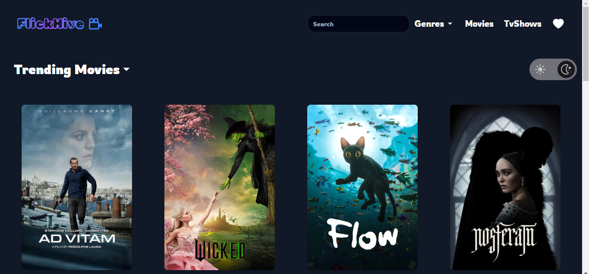
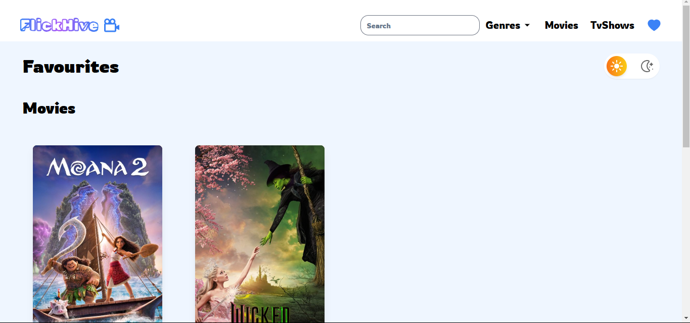

# FlickHive
The Favorite Movies/TV Shows Tracker lets users manage and filter their favorite movies and TV shows by genre. It includes dark mode and stores preferences using local storage for a seamless experience.

## Features

- **Favorites Management**: Add or remove movies and TV shows from your favorites list.
- **Genre Filtering**: Filter movies and TV shows by genre to easily find content that matches your interests.
- **Search Functionality**: Quickly search for specific movies or TV shows with a robust search feature.
- **Dark Mode Toggle**: Switch between light and dark themes for a more comfortable viewing experience.
- **Responsive Design**: Optimized for both mobile and desktop devices to ensure accessibility.
- **Local Storage**: Saves your favorites list in local storage, keeping your preferences across sessions.

## Tech Stack


- **React.js**
- **Context API**
- **TypeScript**
- **Tailwind CSS**
- **Local Storage**
- **Shadcn**

## Screenshots

Here are some screenshots of the application:





# React + TypeScript + Vite

This template provides a minimal setup to get React working in Vite with HMR and some ESLint rules.

Currently, two official plugins are available:

- [@vitejs/plugin-react](https://github.com/vitejs/vite-plugin-react/blob/main/packages/plugin-react/README.md) uses [Babel](https://babeljs.io/) for Fast Refresh
- [@vitejs/plugin-react-swc](https://github.com/vitejs/vite-plugin-react-swc) uses [SWC](https://swc.rs/) for Fast Refresh

## Expanding the ESLint configuration

If you are developing a production application, we recommend updating the configuration to enable type aware lint rules:

- Configure the top-level `parserOptions` property like this:

```js
export default tseslint.config({
  languageOptions: {
    // other options...
    parserOptions: {
      project: ['./tsconfig.node.json', './tsconfig.app.json'],
      tsconfigRootDir: import.meta.dirname,
    },
  },
})
```

- Replace `tseslint.configs.recommended` to `tseslint.configs.recommendedTypeChecked` or `tseslint.configs.strictTypeChecked`
- Optionally add `...tseslint.configs.stylisticTypeChecked`
- Install [eslint-plugin-react](https://github.com/jsx-eslint/eslint-plugin-react) and update the config:

```js
// eslint.config.js
import react from 'eslint-plugin-react'

export default tseslint.config({
  // Set the react version
  settings: { react: { version: '18.3' } },
  plugins: {
    // Add the react plugin
    react,
  },
  rules: {
    // other rules...
    // Enable its recommended rules
    ...react.configs.recommended.rules,
    ...react.configs['jsx-runtime'].rules,
  },
})
```
